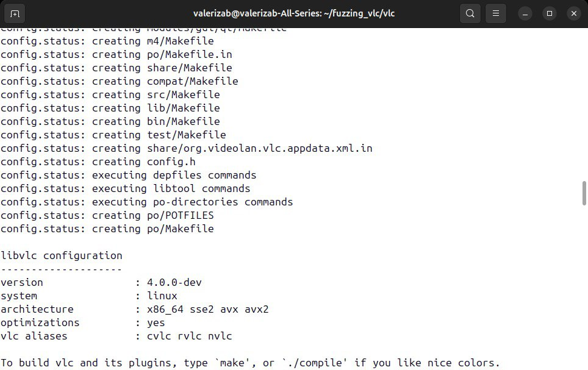

# Процессы безопасной разработки ПО
### SberTech X MIPT

## 1. Суммирование файлов исходного кода
TODO

## 2. Фаззинг тестирование VLC Media Player

### Установка VLC Media Player

- ОС: Ubuntu 22.04 TLS

Клонируем репозиторий с VLC:
```bash
git clone https://github.com/videolan/vlc.git
cd vlc
```

___
### Сборка VLC
Я сознательно опускаю нудный процесс установки недостающих зависимостей, но если вкратце он выглядел как 
несколько итераций вида "попытка сборки -> ошибка -> ее устранение". Будем считать, что все необходимые зависимости установлены и приступим
к сборке.

Будем использовать сборку, оптимизированную под фаззинг. 

```bash
./bootstrap
./configure \
    --enable-fuzzer \
    --enable-debug \
    --enable-libfuzzer \
    --disable-lua \
    --disable-qt \
    --disable-nls \
    CC=clang CXX=clang++
```

Сконфигурировались:



Теперь сборка 

```bash 
make -j$(nproc)
```

Чтобы убедиться, что со сборкой все ок, выведем версию собранного приложения


Настроим переменную окружения VLC

```bash
export LD_LIBRARY_PATH=~/fuzzing_vlc/vlc/lib:~/fuzzing_vlc/vlc/src/.libs:$LD_LIBRARY_PATH
```

### Подготовка к фаззингу

#### Фаззер:

1. Создаем фаззер:

```c 
#include <stdio.h>
#include <stdint.h>
#include <vlc/vlc.h>

int main(int argc, char **argv) {
    if (argc < 2) {
        printf("Usage: %s <file>\n", argv[0]);
        return 1;
    }

    // Создаем экземпляр VLC
    libvlc_instance_t *inst = libvlc_new(0, NULL);
    if (!inst) {
        printf("Failed to create VLC instance\n");
        return 1;
    }

    // Создаем медиа-объект из файла
    libvlc_media_t *media = libvlc_media_new_path(argv[1]);
    if (!media) {
        printf("Failed to create media object\n");
        libvlc_release(inst);
        return 1;
    }

    // Создаем плеер
    libvlc_media_player_t *player = libvlc_media_player_new(inst);
    if (!player) {
        printf("Failed to create media player\n");
        libvlc_media_release(media);
        libvlc_release(inst);
        return 1;
    }

    // Устанавливаем медиа для плеера
    libvlc_media_player_set_media(player, media);

    // Запуск воспроизведения
    int result = libvlc_media_player_play(player);
    if (result == -1) {
        printf("Failed to play media\n");
        libvlc_media_player_release(player);
        libvlc_media_release(media);
        libvlc_release(inst);
        return 1;
    }

    // Асинхронная остановка воспроизведения
    int stop_result = libvlc_media_player_stop_async(player);
    if (stop_result == -1) {
        printf("Failed to stop media\n");
    }

    // Очистка ресурсов
    libvlc_media_player_release(player);
    libvlc_media_release(media);
    libvlc_release(inst);

    return 0;
}
```

   Фаззер берет на вход медиафайл (например, видео или аудио) и пытается:
   - Открыть его через VLC.
   - Проиграть его с помощью VLC Media Player API.
   - Остановить воспроизведение.
   - Зарыть ресурсы и завершить работу.

2. Компилируем фаззер с afl++

```bash
afl-clang-fast -o vlc_afl_fuzzer vlc_afl_fuzzer.c -lvlc
```

#### Корпус:

Источник сэмплов https://sample-videos.com для

- 1 видео mp4 
- 1 аудио mp3

а так же пустые файлы. Обрезаем не пустые файлы командой:
```bash
ffmpeg -i input.mp4 -ss 00:00:00 -t 00:00:02 -c copy output.mp4
```

### Запуск фаззинга

При первом запуске фаззера вернулась ошибка

```
Hmm, your system is configured to send core dump notifications to an external utility.
```

Это значит, что система настроена на использование внешнего обработчика для core dump (например, apport в Ubuntu), 
и это мешает корректному взаимодействию AFL++ с крашами.

Выключим эту настройку для проведения фаззинга:
```bash
echo core | sudo tee /proc/sys/kernel/core_pattern
```
Выключим еще одну штуку по предложению AFL++
```bash
echo performance | sudo tee cpu*/cpufreq/scaling_governor
```
Запускаем:
```bash 
afl-fuzz -t 50 -D -i ~/fuzzing_vlc/corpus -o ~/fuzzing_vlc/findings -- ~/fuzzing_vlc/fuzzers/vlc_afl_fuzzer @@
```


Довольно ожидаемо, на актуальной версии VLC за 3 с половиной часа мы ничего не нашли. Ну и хорошо. 


## 3. Сбор покрытия по результатам фаззинг-тестирования

TODO